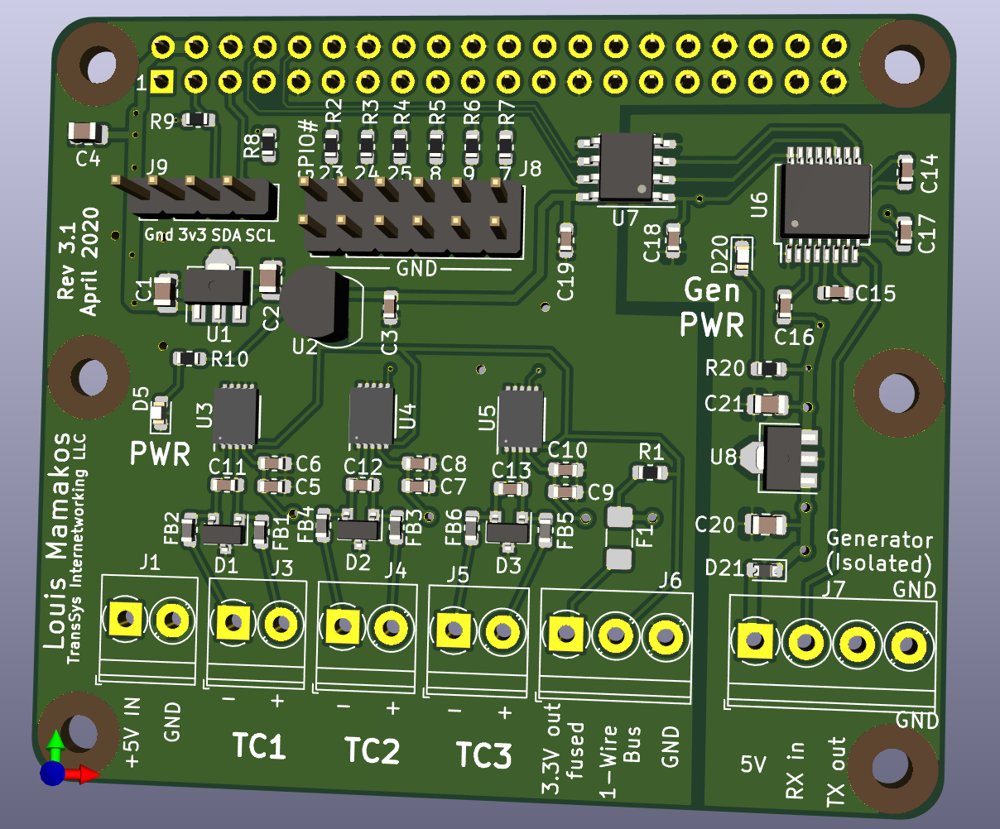

# Raspberry Pi Thermocouple pHat for genmon

## Thanks!
First and foremost, this work is a derivation of the fine work done by
[Mike Lawrence](https://github.com/mikelawrence) with his
[RPi-pHat-Thermocouple](https://github.com/mikelawrence/RPi-pHat-Thermocouple)
project.  That implementation had a different use-case, and I adapted his
great design for my own purposes.

The major changes to his design to this one are:

* Change the form-factor from a Raspberry-Pi Zero sized board to a "full size" version intended for a Raspberry-Pi 2 or -3.
* Add an isolated RS-232 to TTL interface.
* Drop the on-board regulator to 5V, and associated bridge rectifier and "ideal diode".
* Drop the SPI EEPROM for automated "Hat" configuration.
* Drop the alarm buzzer.
* Add screw terminal connections for power, thermocouple and RS-232 connections.
* Add pin headers for driving LED annunciators.
* Add pin headers (with configurable pull-ups) for I2C peripherals.
* Add fuse to protect connections to off-board peripherals.

I'd like to extend my thanks to [Mike](https://github.com/mikelawrence) for sharing his work with the community under an MIT license.  This derivitive work is likewise available under the same license.

# What it is

This is a Raspberry Pi PCB that supports:

* Three MAX31850 1-Wire Thermocouple Converters for remote temperature sensing
* DS18S20 1-Wire Thermometer for local Hat temperature
* Electrically isolated RS-232 interface to the Raspberry Pi's serial port UART.

The goal of this board is to piggyback on a Raspberry Pi running the [genmon](https://github.com/jgyates/genmon)
package.  That software expects to communicate with the 9600 bps serial MODBUS connection on a Generac generator
controller.

Additionally, there are 3 type K thermocouple interfaces which can be used to monitor critical temperatures
in the generator, such as the oil cooler temperature, exhaust air temperature, body temperatore of the
generator, etc.

# Why it is

I have a 22kW generator manufactured by Generac, propane fueled.  The addition of the wonderful 
[genmon](https://github.com/jgyates/genmon) has really added significant value, and allowed me to
integrate the generator with my [Home Assistant](https://home-assistant.io) home automation platform.

On one occasion, I was experiencing an extended power outage, and of course, the generator automatically
started and switch the home loads to it.  About 6 hours into this power outage, I was wondering how it
was working.  The [genmon](https://github.com/jgyates/genmon) software provides a bunch of data on
the current operation, indicating no alarms or faults.  However, after an extended run time, I was
wondering if the generator was overheating or otherwise being stressed?

Measuring some of the relevant components had to be done with, *e.g.,* thermocouples since the usual
Dallas Semiconductor/Maxim 1-wire bus temperature sensors wouldn't work in a high temperature environment.
It was at that time that I stumbled upon Mike Lawarence's work and decided to adapt it.

The first thing that caused me to want to layout a new board was that my use case was different.  I had no
need for a buzzer since my Raspberry Pi was buried inside the generator enclosure and wouldn't ever be
heard.  Further, I *really* wanted to have screw terminals for the thermocouple wires since the
metal alloys used in the thermocouple wires don't take solder easily.  Due to the vibration inherit
to the environment, I wanted to have a really robust mechanical solution for those connections.

Finally, The Raspberry Pi running [genmon](https://github.com/jgyates/genmon) requires a conneciton to
the RS-232 signals on the generator controller's MODBUS interface.  At present, I was using an external
TTL/RS-232 level convertor for this purpose.  However in connecting this up, I create a ground loop -- 
there's a ground path from the generator controller through the RS-232 level converter, though the Raspberry Pi,
through the 12V to 5V USB power support, to the negative battery terminal, and finally through the cable 
from the battery to the generator starter and control electronics.  I shudder to think how this all 
behaves when the starter kicks in during a generator start-up sequence.

So this led to an isolated RS-232 to TTL level converter.  There is a separate power support for this 
part of the circuit, intended to be supplied by power available on the generator controller's MODBUS
accessory connector.  There is an high-speed isolation device (apparently transformer coupled?) rated at
approximately 20MBit/s, substantially higher bandwidth than most common optoisolators.  This isolation
device has separate power/ground connections for each side, and in excess of 1kV of isolation.

# Status

## Genmon variation

* Rev 3.1 of the PCB fixes pin assignment problems on the Maxim MAX3221 RS-232/TTL level converter device.
  * You can order parts from Mouser using this 
[shared BOM](https://www.mouser.com/ProjectManager/ProjectDetail.aspx?AccessID=b36514df12) link. 
* Rev 3.0 PCB was the first version of the whole redesign, manufactured by JCLPCB.

## Original version
Older versions described below are Mike Lawrence's original design in the smaller Raspberry Pi Zero sized
form factor.

* Rev 2.0 PCB has been ordered from OSH Park and has been fully tested.
  * Removed one of the four MAX31850K's.
  * Increased thermocouple input filtering buy adding ferrite beads and a larger capacitor.
  * Added more filtering to thermocouple side of MAX31850K's.
  * Added DC Power connector and switching power supply that powers both the Raspberry Pi and the Hat.
  * The noisy reading the MAX31850K's occasionaly get are reduced in this version but not gone.
  * You can order parts from Mouser using this [shared BOM](https://www.mouser.com/ProjectManager/ProjectDetail.aspx?AccessID=bd69c35967).
  * You can order the PCB from OSH Park using this [link](https://oshpark.com/shared_projects/meYar6Ji).
* Rev 1.2 PCB has been ordered from OSH Park and tested.
  * Discovered the MAX31850K's get a noisy reading about 0.1% of the time. This noise is typically within 5 C but sometimes is greater than 30 C. Adding capacitors did little to help the Rev 1.1 design so most of the 3.3V power was switched to a 3.3V LDO regulator in an attempt to reduce the noise on the 3.3V power seen by the MAX31850K's.
  * You can order parts from Mouser using this [shared BOM](http://www.mouser.com/ProjectManager/ProjectDetail.aspx?AccessID=7612d46eeb).
  * You can order the PCB from OSH Park using this [link](https://oshpark.com/shared_projects/S5a4ZDvw).
* Rev 1.1 PCB was never built.
  * Added a pulldown on the alert signal to prevent the Alert buzzer from sounding on power on.
  * Added an on board DS18S20.
* Rev 1.0 PCB has been ordered from OSH Park and tested.
  * Discovered the linux kernel doesn't seem to support MAX31850K devices without a DS18S20 present. The kernel detects the MAX31850K devices but does not create a w1_slave file to read the temperature. This is most likely a bug in the Linux W1 driver.

## Board Preview



# Kicad Notes

* This PCB design uses some libraries available here [Mike's KiCad Libraries](https://github.com/mikelawrence/KiCad-Libraries).
* This PCB was designed with [KiCad 5.1.5](http://kicad-pcb.org).
* The MAX31850K parts have an exposed pad on the bottom which requires either a reflow oven or hot air to solder properly.

# Design

## Input Power

This board has screw terminals to which you can connect a **regulated 5VDC** power supply.  This is is connected **directlly** to the +5V power pins on the Raspberry Pi GPIO connector.

**You should _never_ connect 5V DC power to the screw terminals if the Raspberry Pi is being powered via it's USB connector!**

If the Raspberry Pi is powered in the usual way via its micro USB connector, then the Raspberry Pi will supply power
to this PCB and power the components on the board.  Alternatively, if it is more convienient to provide regulated
+5V DC power from another source, then the screw terminals are available for that purpose.

The components on the board draw well under 100mA of power at 5V, so there ought to be no concern when
powering from the Raspberry Pi that the PCB is plugged into.

## Isolated RS-232 interface

Separately, there is a 4 pin screw terminal connection for RS-232 transmit and receive as well as generator 
controller ground and generator controller 5VDC.  The ground and power on this 4 position screw terminal is
isolated and distinct from the Raspberry Pi power and the rest of the PCB.  You should not tie the ground on
the RS-232 screw termainal block to any other ground connection on the genmon PCB.


## MAX31850K Thermocouple-to-Digital Converter

Although the MAX38150K datasheet typical application circuit doesn't show the use of ferrite beads many designs seems to include them. That in combination with the larger than normal capacitor across the input will hopefully improve sampling errors even further.

# Raspberry Pi Setup

This setup makes several assumptions. First you are using Raspbian Buster. This software and instructions most likely work on other versions of Raspbian but they have not been tested. Second Python3 is the target programming environment. It is also assumed that you are using the standard `pi` user. Otherwise you will have to edit the commands by replacing `/home/pi` with your user's home directory. Install everything needed by executing the following commands.

```text
sudo apt update
sudo apt -y install git python3-rpi.gpio python3-w1thermsensor python3-paho-mqtt
```

### Get the repository from Github

Clone this repository from Github with the following commands.

```text
cd /home/pi
git clone https://github.com/mikelawrence/RPi-pHat-Thermocouple
```

### Setup Interfaces

For this Hat you will need to enable the 1-Wire interface. From the command line type
`sudo raspi-config` and follow the prompts to install  support in the kernel.


It's time to reboot your Raspberry Pi with `sudo reboot`.

### Test the 1-Wire Temperature Sensors

[Python3-w1thermsensor](https://github.com/timofurrer/w1thermsensor) is a nice 1-Wire python library that also supports command line reading of temperatures from 1-Wire devices. You should have already installed this package in the [Raspberry Pi Setup](#Raspberry-Pi-Setup) section.

Test the single on-board DS18B20 temperature sensor using `w1thermsensor all --type DS18S20`.

```text
pi@studio-fridge:~ $ w1thermsensor all --type DS18S20
Got temperatures of 1 sensors:
  Sensor 1 (00080372f2c4) measured temperature: 28.06 celsius
```

Now test the three MAX38150Ks temperature sensor by using `w1thermsensor all --type MAX31850K`.

```text
pi@studio-fridge:~ $ w1thermsensor all --type MAX31850K
Got temperatures of 3 sensors:
  Sensor 1 (000000181928) measured temperature: 23.75 celsius
  Sensor 2 (00000018192b) measured temperature: 24.0 celsius
  Sensor 3 (000000181d59) measured temperature: 2047.81 celsius
```

The 2047.81 celsius reading is what you get when there is no thermocouple connected to the MAX31850K.
